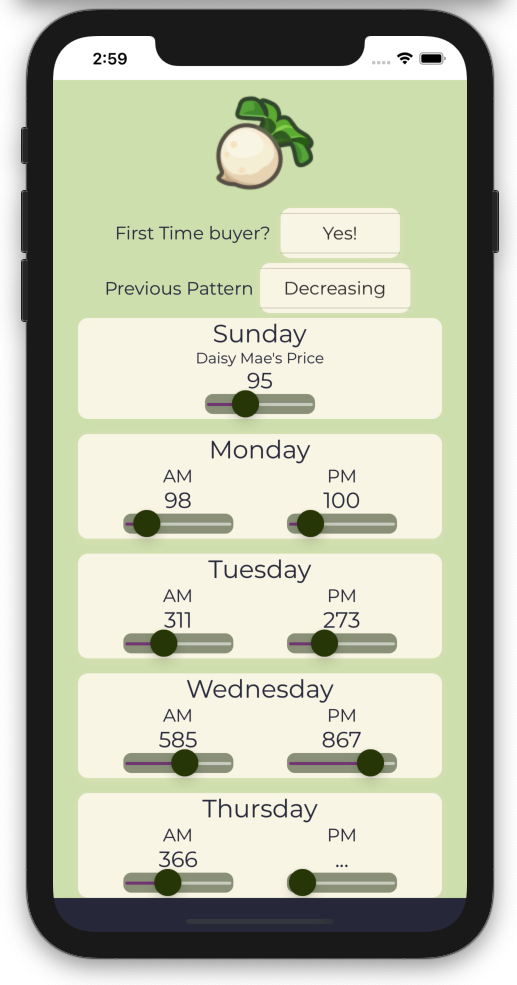
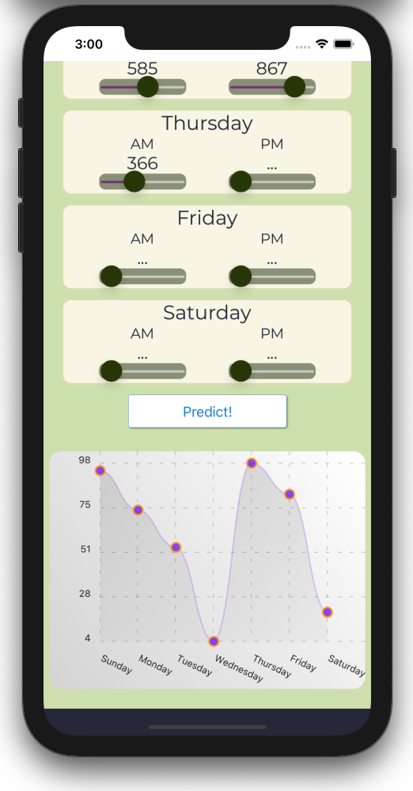

# Turnip Stonk

## Rochelle Roberts Crain

<div align="center">
<p>Your path to becoming a Bellionaire starts now!</p>
	
</div>

## Description

Turnip Stonk is a React Native mobile app to help users take advantage of the Turnip Stock Market in Animal Crossing New Horizons. [Turnip Prophet](https://github.com/mikebryant/ac-nh-turnip-prices) developed this algorithm where given some information of past patterns and current prices, it predicts future turnip prices. Users can make use these predictions to better inform their moves in the Turnip Market to improve profit margins.

My primary goal for developing this app was to build something fun, useful and a little silly. After completing this app, I feel more experience and comfortable with the fundamentals of React Native and Redux. Though I moved on before I published the app, I included screen shots of the app for easy viewing.

## Design

<div align="center">
<span>


</span>
</div>
<br>

To set up the Redux Store, the root `App` Component wraps `TurnipView` with a Provider. `TurnipView` is then divided into two subcomponents: one to handle user inputs and one to display predictions. When a user opens the app, they first see the input section, then scrolling down the user will see a graph with predicted turnip prices. The predictions are updated as users modify or add new prices.

## How to Run Turnip Stonk

### Option 1: Use Expo Client App

- First, download the Expo Client App

  - iOS: [Client iOS](https://itunes.apple.com/app/apple-store/id982107779)
  - Android: [Client Android](https://play.google.com/store/apps/details?id=host.exp.exponent&referrer=blankexample)
  - Web: Any web browser

- QR Code available for Android (iOS update no longer allows this method)
  <br>


### Option 2: Run on your machine

- To run app locally follow the steps below then scan the project's QR code using the Expo Client App

```sh
$ git clone https://github.com/rochellev/animal-crossing-app.git
$ cd  ./animal-crossing-app
$ yarn install
$ expo start
```

## Features

- Input fields for morning and evening turnip prices
- Submit button to calculate predicted turnip values
- Users can use this information to make more Bells!

## Technologies Used

- JavaScript
- React Native
- Redux, Redux Toolkit
- Expo
- HTML, CSS
- Git

## About Me

I am a Software Engineer with a passion for creating apps and actively seeking employment. Check out my [LinkedIn](https://www.linkedin.com/in/rochelle-roberts) and visit [rochellecrain.com](https://www.rochellecrain.com/) to see my To Do Web App in action.

Thanks for stopping by!

## Credits

This project was crated with [Expo](https://reactnative.dev/docs/0.60/getting-started).

[Turnip Prophet](https://github.com/mikebryant/ac-nh-turnip-prices) for their turnip price calculating/predicting algorithm.

[react-native-slider](https://github.com/react-native-community/react-native-slider)
